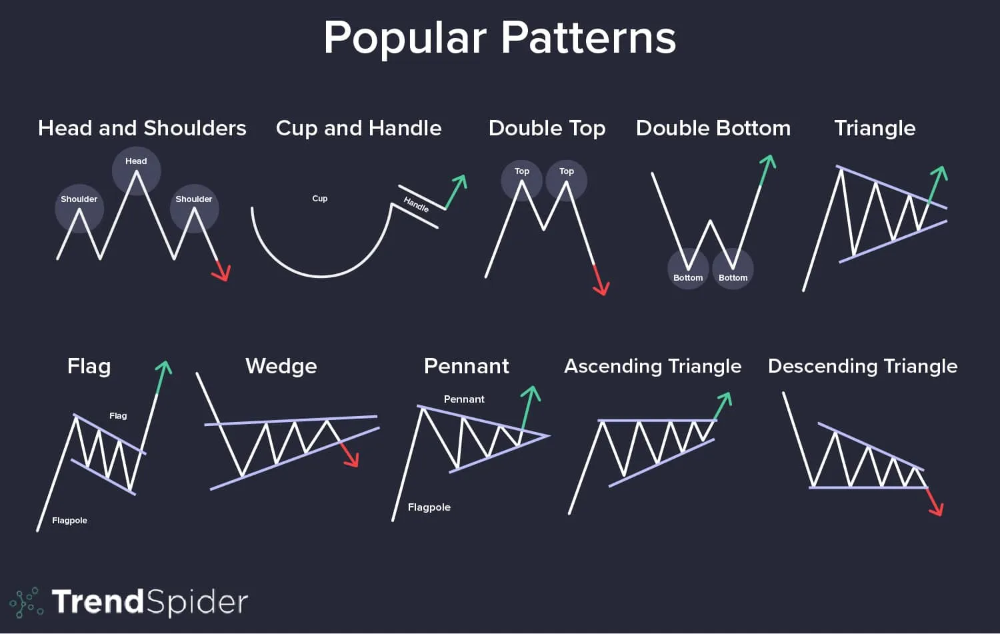
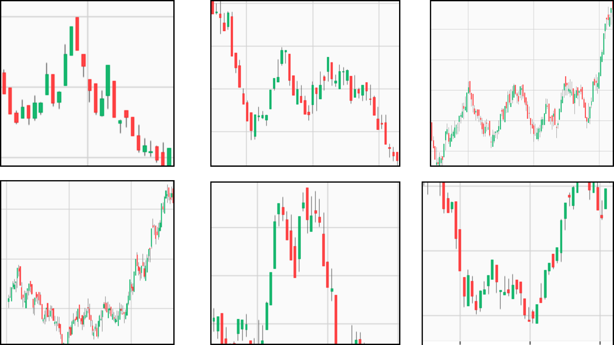
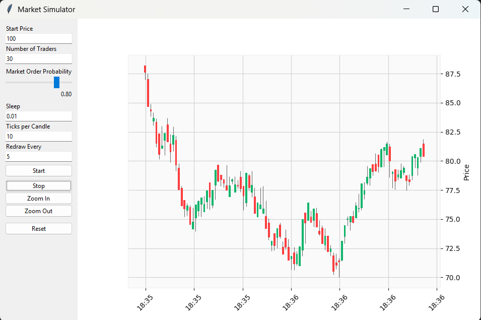

## How to change controls and values
market.py, hybrid.py

Controls
```bash
def on_key(event):
        nonlocal paused, MAX_CANDLES, SLEEP

        if event.key == ' ':
            paused = not paused
            print("Paused" if paused else "Resumed")

        elif event.key == '+':
            MAX_CANDLES = max(20, MAX_CANDLES - 20)
            print(f"Zoom in: {MAX_CANDLES}")

        elif event.key == '-':
            MAX_CANDLES += 20
            print(f"Zoom out: {MAX_CANDLES}")

        elif event.key == 'e':
            SLEEP = max(0.01, SLEEP - 0.01)
            print(f"Speeding up: {SLEEP}")

        elif event.key == 'r':
            SLEEP += 0.01
            print(f"Slowing down: {SLEEP}")
```
Values
```bash
run_market_live(
    start_price=100,
    n_makers=2,
    n_takers=30,
    ticks_per_candle=10,
    redraw_every=5,
)
```
## Some observed patterns



## Simulate the market with custom values
sim.py


